# Архитектура pnfroot

## Общая структура проекта

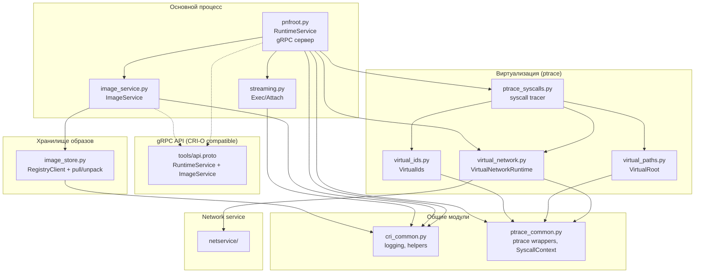

## Модули и их ответственность

| Модуль | Строк | Назначение |
|---|---|---|
| `pnfroot.py` | 1680 | CRI runtime сервер: gRPC RuntimeService, жизненный цикл контейнеров, запуск процессов, сохранение состояния |
| `ptrace_syscalls.py` | 769 | Ptrace-движок: форк tracee, перехват syscall enter/exit, диспетчеризация в модули виртуализации |
| `ptrace_common.py` | 378 | Примитивы ptrace: обёртки ptrace, чтение/запись регистров и памяти tracee, таблицы имён syscall |
| `virtual_paths.py` | 1125 | Виртуальная корневая ФС: подмена путей, bind mount, виртуализация mount(2), ELF interpreter |
| `virtual_ids.py` | 555 | Виртуальные uid/gid: per-pid credentials, перехват get*id/set*id/chown |
| `virtual_network.py` | 1748 | Виртуальная сеть: отслеживание сокетов, rtnetlink, виртуализация connect/bind через netservice |
| `cri_common.py` | 46 | Общие утилиты CRI: настройка логов, декоратор RPC, метки, нормализация image ref |
| `image_service.py` | 166 | CRI ImageService gRPC: list/pull/status/remove образов |
| `image_store.py` | 414 | OCI/Docker registry клиент: pull/manifest/config/layers, извлечение в rootfs |
| `streaming.py` | 824 | CRI Exec сервер: HTTP+WebSocket+SPDY/3.1 transport, stdin/stdout/stderr/resize |
| `netservice/` | 1410 | Unix-socket сетевой сервис: управление IP, проброс портов, маршрутизация, TCP-proxy |

---

## gRPC API

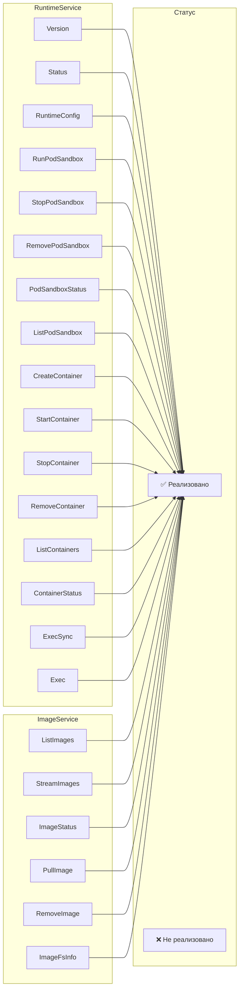

---

## Жизненный цикл Pod / Container

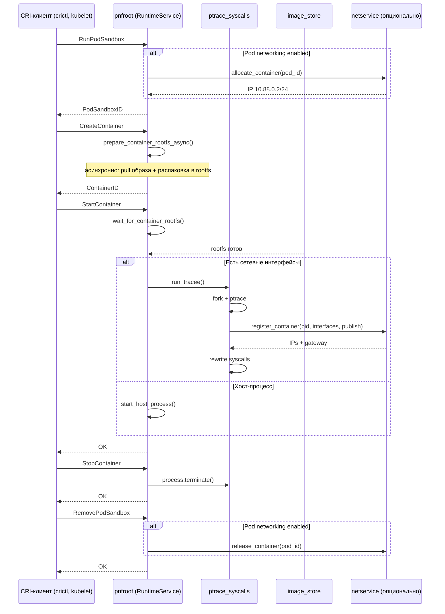

---

## Перехват системных вызовов (ptrace)

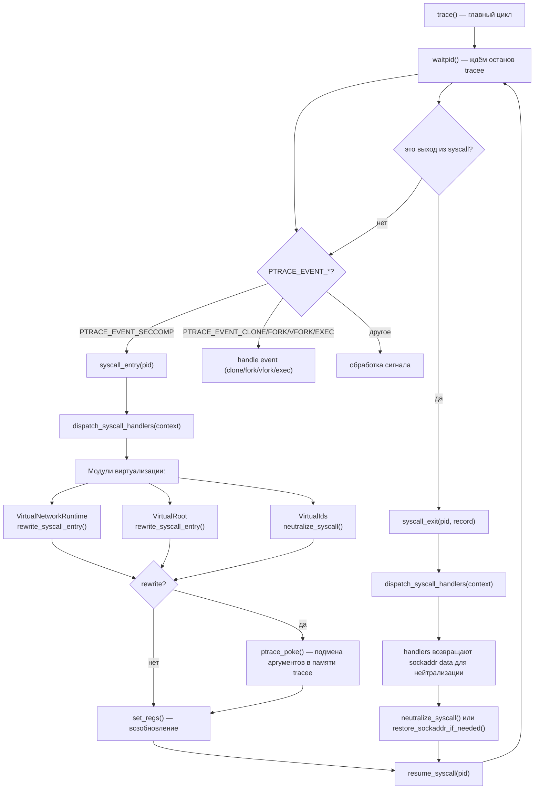

---

## Виртуальная корневая ФС

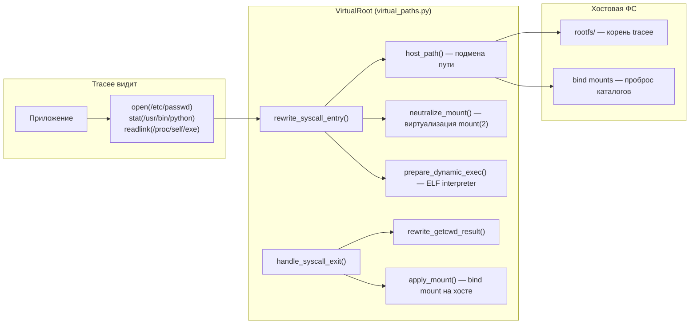

---

## Виртуальные uid/gid

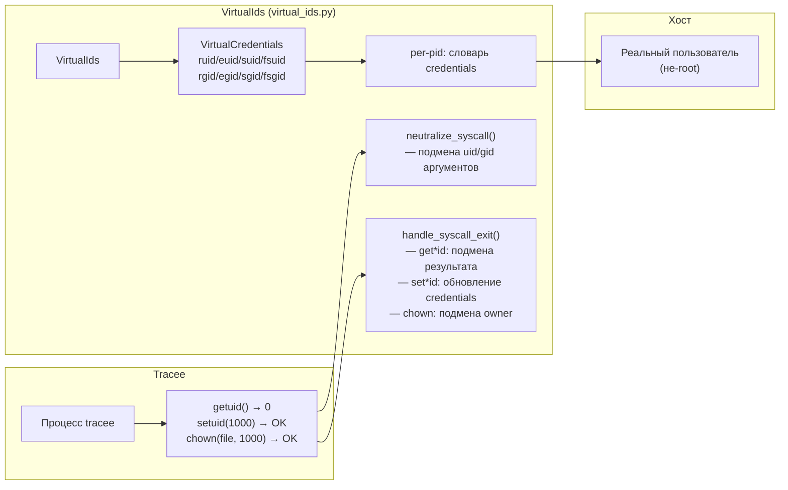

---

## Виртуальная сеть

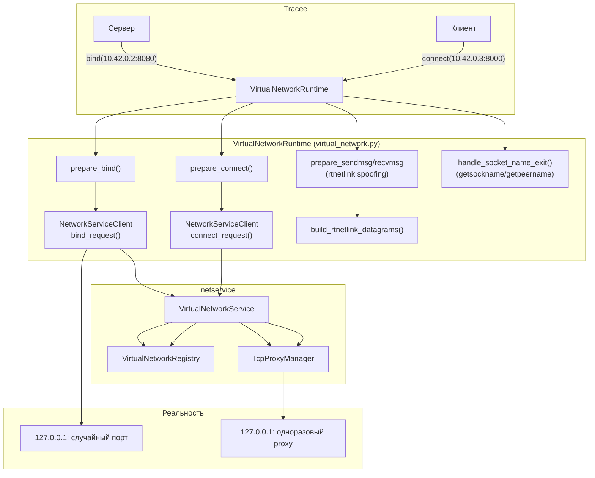

---

## netservice (детально)

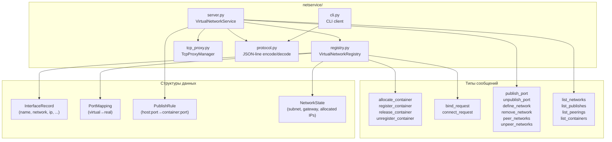

---

## Исполнение команд (Exec)

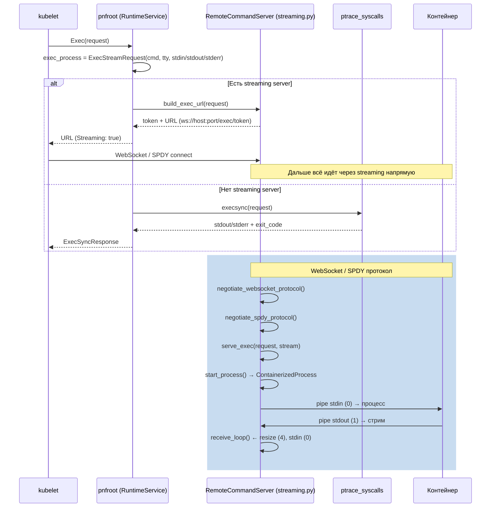

---

## Pull образа и rootfs

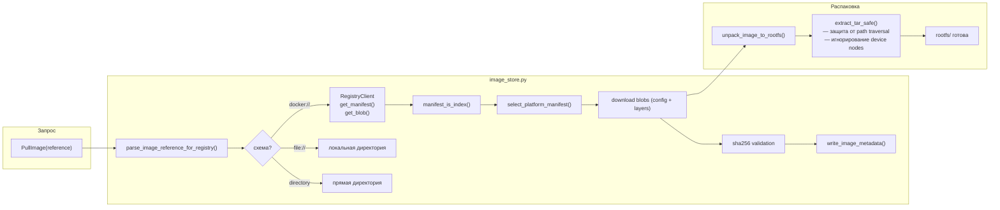

---

## Схема данных

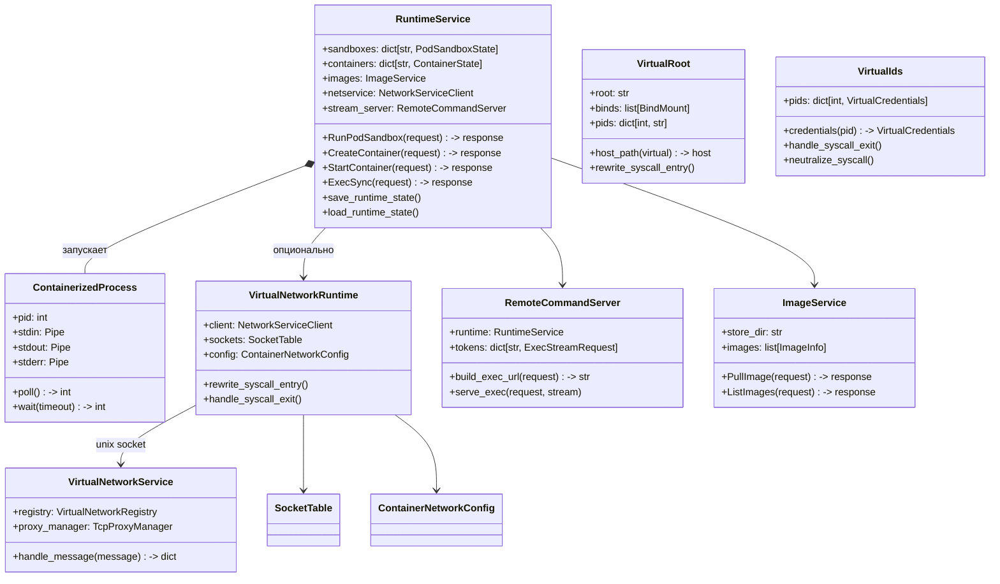

---

## Структура директорий

```mermaid
graph TD
    ROOT["pnfroot/"] --> PNF["pnfroot.py — CRI runtime server"]
    ROOT --> PTRACE["ptrace_syscalls.py — ptrace tracer"]
    ROOT --> PCOMMON["ptrace_common.py — ptrace primitives"]
    ROOT --> VNET["virtual_network.py — virtual network"]
    ROOT --> VPATHS["virtual_paths.py — virtual filesystem"]
    ROOT --> VIDS["virtual_ids.py — virtual uid/gid"]
    ROOT --> CRI["cri_common.py — shared CRI utils"]
    ROOT --> IMG["image_service.py — CRI ImageService"]
    ROOT --> ISTORE["image_store.py — OCI registry + unpack"]
    ROOT --> STREAM["streaming.py — Exec/Attach streaming"]
    ROOT --> README["README.md"]

    ROOT --> NS["netservice/"]
    NS --> NSS["server.py — VirtualNetworkService"]
    NS --> NSR["registry.py — VirtualNetworkRegistry"]
    NS --> NST["tcp_proxy.py — TcpProxyManager"]
    NS --> NSP["protocol.py — JSON-line encode/decode"]
    NS --> NSC["cli.py — CLI client"]

    ROOT --> TOOLS["tools/"]
    TOOLS --> PROTO["api.proto — CRI gRPC spec"]
    TOOLS --> PB2["api_pb2.py — generated proto types"]
    TOOLS --> PB2GRPC["api_pb2_grpc.py — generated gRPC stubs"]

    ROOT --> TESTS["tests/"]
    TESTS --> TP["test_pnfroot.py — unit/integration"]
    TESTS --> TV["test_virtual_network.py — network tests"]
    TESTS --> TN["test_netservice_integration.py — netservice tests"]
    TESTS --> FIXTURES["fixtures/ — test data"]

    ROOT --> DOCS["docs/"]
    DOCS --> ARCH["architecture.md — диаграммы"]
    DOCS --> NET["networking_ru.md — документация сети"]
